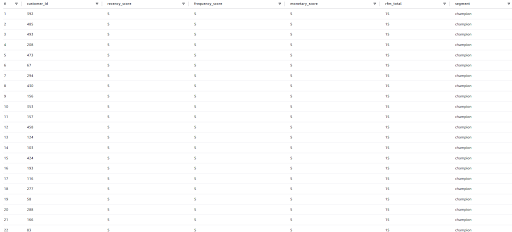
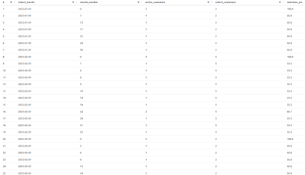

# retail-sql-analytics
A serverless SQL analytics on AWS- window functions, RFM and cohort segmentation, run serverlessly on AWS via S3, Glue, and Athena on a self generated data set, at zero cost and no local database.

## Architecture

generate_data.py (local, one-time)
│
▼
S3 bucket (private)
│
▼
Glue Crawler
(catalogs schema)
│
▼
Athena
(serverless SQL)
│
▼
GitHub repo (this README, SQL scripts, screenshots)

| Service | Role | Cost |
|---|---|---|
| S3 | Stores raw CSVs (private bucket) | ~$0 (few MB, well within free tier) |
| Glue Crawler | Infers schema, populates Data Catalog | Free tier covers this easily; run on-demand only |
| Athena | Runs analytical SQL over S3 | ~$5/TB scanned — a few cents total on this dataset |

## Dataset

Synthetic retail data generated locally with `scripts/generate_data.py`
(Faker, fixed random seed for reproducibility):

- `customers.csv` — 500 rows
- `products.csv` — 80 rows
- `orders.csv` — 3,000 rows
- `order_items.csv` — ~9,000 rows

## Setup

### 1. Generate and upload the data
```bash
pip install faker
python scripts/generate_data.py
```
Then, in the S3 console: create a private bucket, and upload each CSV
into its **own subfolder** (important — Glue/Athena expect one
folder per table):

s3://<your-bucket>/retail/customers/customers.csv
s3://<your-bucket>/retail/products/products.csv
s3://<your-bucket>/retail/orders/orders.csv
s3://<your-bucket>/retail/order_items/order_items.csv


### 2. Catalog the data with Glue
- Glue console → Databases → create `retail_analytics`
- Glue console → Crawlers → create a crawler pointed at `s3://<your-bucket>/retail/`, on-demand schedule
- Run the crawler once — it creates one table per subfolder

*(`sql/01_athena_ddl.sql` shows the equivalent DDL if you'd rather define tables by hand.)*

### 3. Query with Athena
- Athena console → Administration → Workgroups → `primary` → Edit →
  set a query result location (`s3://<your-bucket>/athena-results/`)
- Run the queries in `sql/02_athena_analytics_queries.sql`

**Note:** Glue infers CSV date columns as `string`, not `date`. Cast
before using date functions, e.g. `CAST(order_date AS DATE)` —
already applied throughout the query file.

## SQL showcase

| Query | Concepts demonstrated |
|---|---|
| Running total + moving average | Window functions (`SUM() OVER`, `AVG() OVER ... ROWS BETWEEN`) |
| RFM customer segmentation | CTEs, `NTILE()`, `CASE` scoring logic |
| Monthly cohort retention | Self-joins, `date_trunc`/`date_diff`, cohort analysis pattern |
| Top 3 products per category | `RANK() OVER (PARTITION BY ...)` |
| Repeat vs one-time customers | Conditional aggregation |

### Example results

**RFM customer segmentation**



**Monthly cohort retention**


